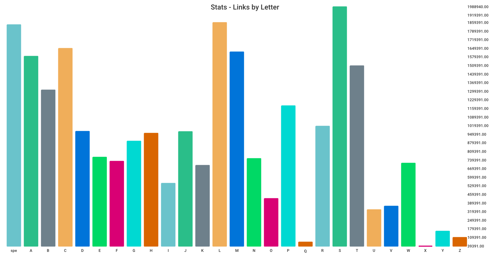

With the file enwiki-20210620-abstract.xml (6Go) from the autosave of [Wikipedia](https://meta.wikimedia.org/wiki/Data_dumps) , we will parse it and save datas in a sqlite database and export stats in data visualization.
It is a training on larger data in go code.

TLDR: result :


# parsing

## source file

xml file start with a `feed` anchor them list terms with the tags:

```
<doc>
<title>Wikipedia: Mariapia Degli Esposti</title>
<url>https://en.wikipedia.org/wiki/Mariapia_Degli_Esposti</url>
<abstract>Cancer Council of Western Australia Cancer Researcher of the Year 2017Research Excellence Awards - Cancer Council Western Australia (2017)</abstract>
<links>
<sublink linktype="nav"><anchor>Research</anchor><link>https://en.wikipedia.org/wiki/Mariapia_Degli_Esposti#Research</link></sublink>
<sublink linktype="nav"><anchor>Education</anchor><link>https://en.wikipedia.org/wiki/Mariapia_Degli_Esposti#Education</link></sublink>
<sublink linktype="nav"><anchor>Occupation</anchor><link>https://en.wikipedia.org/wiki/Mariapia_Degli_Esposti#Occupation</link></sublink>
<sublink linktype="nav"><anchor>Current</anchor><link>https://en.wikipedia.org/wiki/Mariapia_Degli_Esposti#Current</link></sublink>
<sublink linktype="nav"><anchor>Former</anchor><link>https://en.wikipedia.org/wiki/Mariapia_Degli_Esposti#Former</link></sublink>
<sublink linktype="nav"><anchor>Personal life</anchor><link>https://en.wikipedia.org/wiki/Mariapia_Degli_Esposti#Personal_life</link></sublink>
<sublink linktype="nav"><anchor>References</anchor><link>https://en.wikipedia.org/wiki/Mariapia_Degli_Esposti#References</link></sublink>
</links>
</doc>
```

`title`, `url` and `abstract` will be easy to parse and put in database. `links` and the `sublinks` are more trickies (not really but put them on the side for now) we will just save the count of `sublinks` in each `doc` for now.

> parsing and save DONE
>
> > error handling TODO

## database structure

From the structure of the xml, the database structure look like:
table `doc`

```
id int
title string
url string
abstract string
links int
```

table `unknown`

```
id int
unknowntag string
iddoc int // relationnal with `doc`
```

> database, open and insert DONE

## others

- What about unknown tags ? > they will be ignore for the original parsing but they will be store in another table.
- What about if the source file is corrumpt, it is an autosave of wikipedia, like missing closing tags ? > the errors will be handle in the code.
- TDD ? > a lot of new things for eme (parsing xml, sqlite, data visualization), so no, not this time.
- concurrency ? > it will be a perfect case, but start single, if the performances are bad we will come back to it (and I am not sure sqlite like multi writing).

## **execution**

Parsing and saving the `enwiki-20210620-abstract.xml` file take 5 hours 18 min and an average of 25% of the CPU and no RAM.
The sqlite file is 1151 Mo and contain 6322427 lines.

For each insert sqlite create a journal file, this create CPUiowait and maybe reveal a problem: do we execute `CREATE TABLE` at each time ?

The parsing is correct but it is take too much time. Will need optimizations, maybe parsing of `links` and counting `sublink` is the slow part.

# data visualization

Having datas is good, charts is better. The datas don't allow to directly have a chart, this will need some choices. Numbers of links by length of titles, numbers of links by alphabet, ...

## tools

A lot of tools for go, need some tries:

- https://github.com/go-echarts/go-echarts > use javascript
- https://github.com/gonum/plot > simple but more verbose than go-chart
- https://github.com/wcharczuk/go-chart > simple
- https://github.com/vdobler/chart > result seen nice but too verbose

> We will go with wcharczuk/go-chart for start

## **execution**

Parsing of titles to get the letter works fine.
The go-chart library is every efficient.

Two issues:

- unknown characters aren't handle, so they are in the chart but not readable (bad encoding ?).
- As we use a map, the result in the chart aren't sorted.
